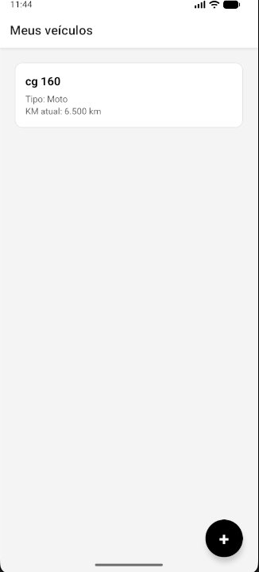
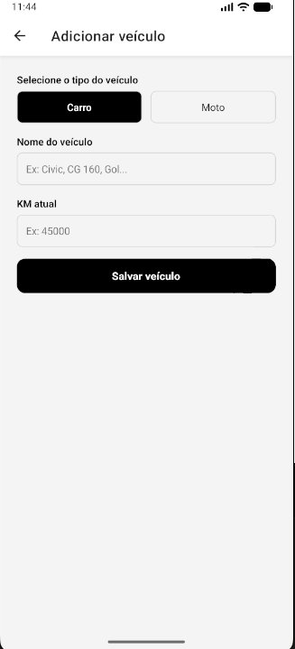
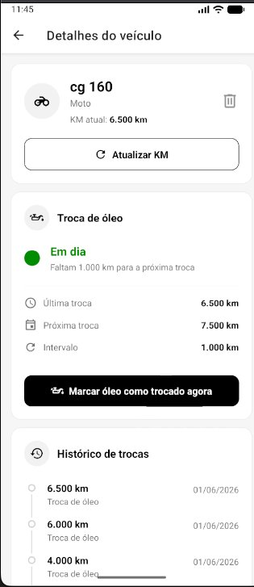
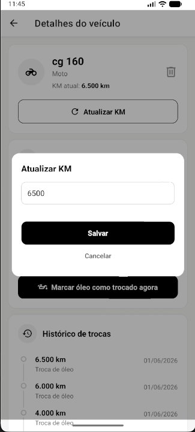

# AutoCare 🔧

Aplicativo mobile para controle de manutenção veicular, com foco em usuários que nem sempre têm acesso à internet.

## 📱 Telas

<p align="center">
  
  
  
  
  
</p>

---

## 💡 Sobre o projeto

O AutoCare nasceu de um problema real: muitos motoristas, especialmente em regiões com acesso limitado à internet, perdem o controle das manutenções do veículo por falta de uma ferramenta simples e offline.

O app permite registrar veículos, acompanhar o status da troca de óleo e visualizar o histórico de manutenções — tudo sem depender de conexão.

---

## 🏗️ Decisões técnicas

### Offline-first com SQLite

Os dados são armazenados localmente com `expo-sqlite`, garantindo funcionamento completo sem internet. A escolha do SQLite sobre o AsyncStorage foi intencional: suporta queries relacionais (veículos → manutenções com foreign key), é mais performático e está preparado para crescer junto com o app.

A arquitetura já está preparada para sincronização com backend — quando o usuário estiver online, os dados locais serão enviados para a nuvem.

### Padrão de arquitetura

- `src/database/` — inicialização do banco e repositories (acesso a dados)
- `src/utils/` — funções puras reutilizáveis
- `src/types/` — tipagem centralizada
- `src/screens/` — telas da aplicação, responsáveis apenas por renderizar

### Status de manutenção

O status é calculado com base no KM restante para a próxima troca:

- ✅ **Em dia** — mais de 500 km restantes
- 🟠 **Próximo da troca** — menos de 500 km restantes
- 🔴 **Troca vencida** — KM ultrapassado

---

## 🚀 Tecnologias

- [React Native](https://reactnative.dev/)
- [Expo](https://expo.dev/)
- [expo-sqlite](https://docs.expo.dev/versions/latest/sdk/sqlite/) — banco de dados local
- [React Navigation](https://reactnavigation.org/) — navegação entre telas
- [EAS Build](https://docs.expo.dev/build/introduction/) — build e deploy na nuvem
- TypeScript

---

## ⚙️ CI/CD

O projeto utiliza **GitHub Actions + EAS Build** para automatizar o processo de build e publicação na Play Store.

A cada push na branch `main`, o pipeline:

1. Instala as dependências
2. Dispara o build via EAS na nuvem
3. Publica automaticamente na Play Store

---

## ▶️ Como rodar localmente

```bash
# Clone o repositório
git clone https://github.com/coutojeferson/autocare.git

# Instale as dependências
cd autocare
npm install

# Inicie o projeto
npx expo start
```

> Requisitos: Node.js 18+, Expo Go instalado no celular ou emulador Android/iOS configurado.

---

## 🔮 Próximos passos

- [ ] Backend para sincronização dos dados quando online
- [ ] Testes unitários e de integração
- [ ] Suporte a outros tipos de manutenção (freios, pneus, filtros)
- [ ] Notificações locais quando a troca estiver próxima
- [ ] Publicação na App Store

---

## 👨‍💻 Autor

Feito por [Jeferson Couto](https://github.com/coutojeferson)
